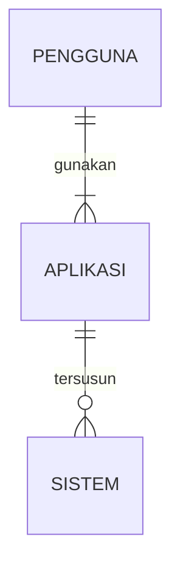
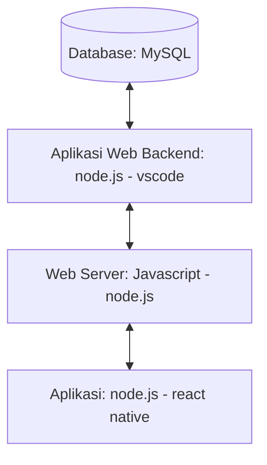

## 1.1 Latar Belakang

Banyak sekali hal di dunia saat ini yang mana sangat membutuhkan sebuah jaringan, mulai dari sesuatu yang biasa kita gunakan sehari hari hingga sesuatu seperti hal kecil seperti televisi dan smartphone. Jaringan menjadi sangat dibutuhkan diera digital ini. Ini menjadi alasan saya membuat aplikasi ini, agar para pengguna dapat mesmatikan kecepatan jaringan yang mereka pakai sebelum digunakan.

## 1.2. Deksripsi Teknologi Informasi

Saya menggunakan beberapa teknologi untuk membangun aplikasi ini, yaitu :
1. mySQL digunakan untuk mambangun database untuk pengolahan data pada aplikasi yang dibuat
2. node.js, javascript, dan vscode digunakan untuk membuat backend
3. node.js dan javascript digunakan untuk web server
4. figma untuk membuat desain
5. javascript dan react native untuk menjalankan aplikasi

## 1.3. Branding

Merk : limitless

Tagline : Kecepatan yang dipastikan

campaign : Tempat dimana anda bisa memastikan secepat dan selancar apa internet yang anda gunakan, karena kita hidup di era internet menjadi salah satu kebutuhan utama untuk sebagian besar dari kita.

Target User : 
        
        *usia 12+
        
        *seorang yang senang mencari informasi terkini
        
        *seorang yang gemar bermain game online
        
        *seorang teknisi jaringan
        
User Experience Theme : 
        
        *mudah
        
        *cepat
        
        *sederhana
        
        *inspirasi desain : 

## 2. User Story

Sebagai | Saya ingin bisa | Sehingga | Prioritas
---|---|---|---
Pengguna | mengecek kecepatan jaringan | bisa melakukan aktifitas daring dengan tenang | ⭐⭐⭐⭐⭐
Pengguna | memastikan kestabilan jaringan | bisa bermain game online tanpa khawatir | ⭐⭐⭐⭐⭐
Pengguna | mendeteksi masalah jaringan | bisa memperbaiki secara efektif | ⭐⭐⭐⭐⭐
Pengguna | membandingkan kecepatan jaringan | bisa memilih jaringan paling cepat dan stabil | ⭐⭐⭐⭐
Pengguna | memilih server terbaik | bisa menggunakan internet paling nyaman | ⭐⭐⭐⭐
Pengguna | memantau perubahan kinerja | bisa tahu kapan waktu terbaik untuk menggunakannya | ⭐⭐⭐⭐
Pengguna | memberikan Bukti untuk Keluhan ke Penyedia Layanan | keluhan bisa langsung diperbaiki | ⭐⭐⭐

## 3. Struktur Data 

## 4. Arsitektur Sistem

## 5. Teknologi, Library, dan Framework

Teknologi :

       *laptop
       *internet

*Library :
       
       *speedtest-net
       *nodemon
       *jquery

Framework :

## 6. Desain User Experience dan User Interface

.png)

## 7. Demonstrasi Video

Link youtube nya

## 8. Bagaimana mesin komputasi dan sistem operasi berperan dalam produk teknologi informasimu ?

Link youtube nya di detik jawaban ini

## 9. Bagaimana algoritma, struktur data, dan bahasa pemrograman berperan dalam produk teknologi informasimu ?

Link youtube nya di detik jawaban ini

## 10. Bagaimana metode pengembangan perangkat lunak / Software Development Life Cycle berperan dalam produk teknologi informasimu ?

Link youtube nya di detik jawaban ini

## 11. Bagaimana database / sistem basis data berperan dalam produk teknologi informasimu ?

Link youtube nya di detik jawaban ini 
