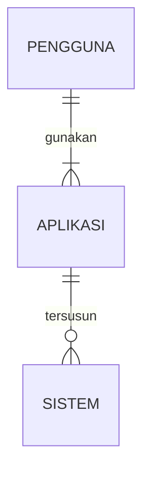

## 1.1 Latar Belakang

Banyak sekali hal di dunia saat ini yang mana sangat membutuhkan sebuah jaringan, mulai dari sesuatu yang biasa kita gunakan sehari hari hingga sesuatu seperti hal kecil seperti televisi dan smartphone. Jaringan menjadi sangat dibutuhkan diera digital ini. Ini menjadi alasan saya membuat aplikasi ini, agar para pengguna dapat mesmatikan kecepatan jaringan yang mereka pakai sebelum digunakan.

## 1.2. Deksripsi Teknologi Informasi

Aplikasi ini digunakan untuk mengecek kecepatan jaringan yang akan digunakan atau jaringan yang sedang diatur atau disetting.

## 1.3. Branding

Merk : limitless

Tagline : Kecepatan yang dipastikan

campaign :

Target User : 
        
        *usia 12+
        
        *seorang yang senang mencari informasi terkini
        
        *seorang yang gemar bermain game online
        
        *seorang teknisi jaringan
        
User Experience Theme : 
        
        *mudah
        
        *cepat
        
        *sederhana
        
        *inspirasi desain : 

## 2. User Story

Sebagai | Saya ingin bisa | Sehingga | Prioritas
---|---|---|---
Pengguna | mengecek kecepatan jaringan | bisa melakukan aktifitas daring dengan tenang | ⭐⭐⭐⭐⭐
|||
Pengguna | memastikan kestabilan jaringan | bisa bermain game online tanpa khawatir | ⭐⭐⭐⭐⭐
|||
Pengguna | membandingkan kecepatan jaringan | bisa memilih jaringan paling cepat dan stabil | ⭐⭐⭐⭐


## 3. Struktur Data 


## 4. Arsitektur Sistem

```mermaid
flowchart TD
    markdown["Database - mySQL"] --> markdown ["Aplikasi Web Backend - node.js, javascript"]
    markdown["Aplikasi Web Backend - node.js, javascript"] --> markdown["Web Server - node.js, javascript"]
    markdown["Web Server - node.js, javascript"] --> markdown["Aplikasi android - javascript, react native"]
```

## 5. Teknologi, Library, dan Framework

Teknologi :

       *laptop

       *internet

*Library :
       
       *npm install speedtest-net

## 6. Desain User Experience dan User Interface


)

## 7. Demonstrasi Video

Link youtube nya

## 8. Bagaimana mesin komputasi dan sistem operasi berperan dalam produk teknologi informasimu ?

Link youtube nya di detik jawaban ini

## 9. Bagaimana algoritma, struktur data, dan bahasa pemrograman berperan dalam produk teknologi informasimu ?

Link youtube nya di detik jawaban ini

## 10. Bagaimana metode pengembangan perangkat lunak / Software Development Life Cycle berperan dalam produk teknologi informasimu ?

Link youtube nya di detik jawaban ini

## 11. Bagaimana database / sistem basis data berperan dalam produk teknologi informasimu ?

Link youtube nya di detik jawaban ini 
